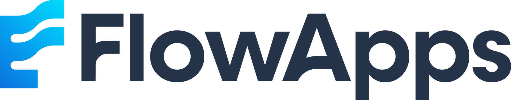

  <a href="https://flowapps.me">
    <picture>
      <source media="(prefers-color-scheme: dark)" srcset="./assets/flowapps-logo-dark.svg">
      
    </picture>
  </a>

<strong>Empower Your Business, Simplify Success.</strong>

FlowApps builds software that takes the friction out of everyday work, for businesses and for the people in them. Arabic and English are first-class in everything we ship, including full right-to-left layouts.

## What we build

| Product | What it is | Status |
| --- | --- | --- |
| **FlowApps** | A business management platform: customers, invoices and payments in one place, with WhatsApp built in for talking to clients. | Private beta |
| **[Emailify](https://flowapps.me/emailify)** | A mail app that keeps Outlook, Microsoft 365 and Gmail accounts side by side, one tap apart. | Android, closed testing on Google Play |
| **TodoHub** | A to-do list where every task can carry its own steps. Your list stays on your device and syncs between your devices over Wi-Fi, with no account. | Android, closed testing on Google Play |

## How we work

- **Simple first.** A common task should take a few taps and need no manual.
- **Arabic and English, equally.** Right-to-left is designed in, not translated in afterwards.
- **Your data is yours.** We collect as little as we can and say plainly what we do collect. See our [privacy policy](https://flowapps.me/privacy).
- **Proven technology.** We choose tools we can run and maintain for years.

## Get in touch

- Website: [flowapps.me](https://flowapps.me)
- Email: [contact@flowapps.me](mailto:contact@flowapps.me)
- Early access or partnerships: write to us and say which product you are interested in.
- Found a security issue? Email us before disclosing it publicly, and we will reply.

## Company

FlowApps OÜ is registered in Tallinn, Estonia (registry code [17340906](https://ariregister.rik.ee/eng/company/17340906)).

Most of our repositories are private. FlowApps software is proprietary unless a repository's licence says otherwise.
